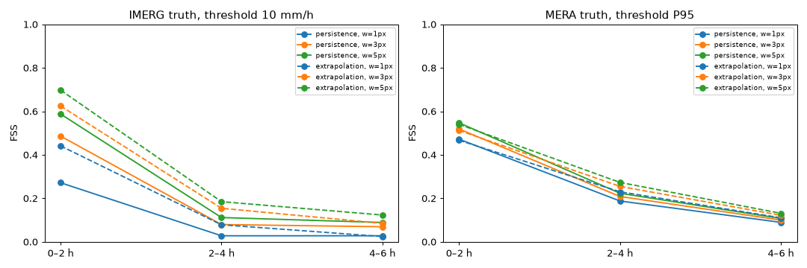

# Baseline verification — Mandi cloudbursts (mandi_2025_06_30)

Generated 2026-09-23 13:30 UTC by `tools/evaluate.py`. Period 2025-06-29 to 2025-07-02. Pilot box {'lat_min': 31.5, 'lat_max': 32.0, 'lon_min': 76.8, 'lon_max': 77.3}.

**Scope.** Only reference methods (persistence, uniform-motion extrapolation) are scored. MeghPrahari's own models have **not** been trained on real data yet, so they have no row here. One event is not a climatology: these numbers describe this case only.

## Truth: IMERG (30-min, 0.1000°, units mm/h)

Thresholds: 10 mm/h = 10, 5 mm/h = 5

### Fractions Skill Score (window in pixels; FSS ≥ 'useful' means skilful at that scale)

| method | lead | threshold | FSS w=1 | FSS w=3 | FSS w=5 | useful |
|---|---|---|---|---|---|---|
| persistence | 0–2 h | 10 mm/h | 0.27 | 0.49 | 0.59 | 0.51 |
| persistence | 0–2 h | 5 mm/h | 0.41 | 0.58 | 0.65 | 0.52 |
| persistence | 2–4 h | 10 mm/h | 0.03 | 0.08 | 0.11 | 0.51 |
| persistence | 2–4 h | 5 mm/h | 0.11 | 0.17 | 0.22 | 0.52 |
| persistence | 4–6 h | 10 mm/h | 0.03 | 0.07 | 0.09 | 0.51 |
| persistence | 4–6 h | 5 mm/h | 0.08 | 0.13 | 0.16 | 0.52 |
| extrapolation (uniform motion) | 0–2 h | 10 mm/h | 0.44 | 0.62 | 0.70 | 0.51 |
| extrapolation (uniform motion) | 0–2 h | 5 mm/h | 0.54 | 0.70 | 0.77 | 0.53 |
| extrapolation (uniform motion) | 2–4 h | 10 mm/h | 0.08 | 0.15 | 0.18 | 0.51 |
| extrapolation (uniform motion) | 2–4 h | 5 mm/h | 0.22 | 0.32 | 0.38 | 0.52 |
| extrapolation (uniform motion) | 4–6 h | 10 mm/h | 0.02 | 0.09 | 0.12 | 0.51 |
| extrapolation (uniform motion) | 4–6 h | 5 mm/h | 0.13 | 0.20 | 0.24 | 0.52 |

### Pixel contingency (peak rain in the lead window ≥ threshold)

| method | lead | threshold | pixels | observed events | POD | FAR | CSI |
|---|---|---|---|---|---|---|---|
| persistence | 0–2 h | 10 mm/h | 107400 | 1672 | 0.20 | 0.58 | 0.16 |
| persistence | 0–2 h | 5 mm/h | 107400 | 5330 | 0.31 | 0.40 | 0.26 |
| extrapolation (uniform motion) | 0–2 h | 10 mm/h | 103752 | 1657 | 0.43 | 0.55 | 0.28 |
| extrapolation (uniform motion) | 0–2 h | 5 mm/h | 103752 | 5217 | 0.49 | 0.39 | 0.37 |
| persistence | 2–4 h | 10 mm/h | 107400 | 1343 | 0.02 | 0.96 | 0.01 |
| persistence | 2–4 h | 5 mm/h | 107400 | 4713 | 0.09 | 0.85 | 0.06 |
| extrapolation (uniform motion) | 2–4 h | 10 mm/h | 94340 | 1147 | 0.08 | 0.93 | 0.04 |
| extrapolation (uniform motion) | 2–4 h | 5 mm/h | 94340 | 4181 | 0.20 | 0.75 | 0.12 |
| persistence | 4–6 h | 10 mm/h | 107400 | 1340 | 0.02 | 0.96 | 0.01 |
| persistence | 4–6 h | 5 mm/h | 107400 | 4670 | 0.07 | 0.89 | 0.04 |
| extrapolation (uniform motion) | 4–6 h | 10 mm/h | 87396 | 955 | 0.02 | 0.97 | 0.01 |
| extrapolation (uniform motion) | 4–6 h | 5 mm/h | 87396 | 3674 | 0.11 | 0.83 | 0.07 |

### Warning lead time in the pilot box (onset = first frame on/after 30 Jun with box max ≥ 10 mm/h after ≥ 3 h below it)

Observed onset: **2025-06-30 03:30 UTC** (09:00 IST).

| method | first warning (0–2 h window, box max ≥ threshold) | lead time |
|---|---|---|
| persistence | 29 Jun 21:30 UTC | 360 min |
| extrapolation (uniform motion) | – | miss (no warning in the 6 h before onset) |

A persistence warning before onset only happens if rain already above the threshold was in the box earlier (e.g. an earlier storm); it is not genuine anticipation. The onset is found automatically from this truth dataset; compare it with the event ledger (news: night of 30 Jun - 1 Jul IST).

## Truth: MERA (60-min, 0.0375°, **units not confirmed** → percentile thresholds of all MERA values in the period)

Thresholds: P95 = 4.61, P99 = 9.08

### Fractions Skill Score (window in pixels; FSS ≥ 'useful' means skilful at that scale)

| method | lead | threshold | FSS w=1 | FSS w=3 | FSS w=5 | useful |
|---|---|---|---|---|---|---|
| persistence | 0–2 h | P95 | 0.47 | 0.52 | 0.55 | 0.53 |
| persistence | 0–2 h | P99 | 0.29 | 0.35 | 0.38 | 0.51 |
| persistence | 2–4 h | P95 | 0.19 | 0.21 | 0.22 | 0.53 |
| persistence | 2–4 h | P99 | 0.07 | 0.08 | 0.09 | 0.51 |
| persistence | 4–6 h | P95 | 0.09 | 0.10 | 0.11 | 0.53 |
| persistence | 4–6 h | P99 | 0.00 | 0.01 | 0.00 | 0.51 |
| extrapolation (uniform motion) | 0–2 h | P95 | 0.47 | 0.51 | 0.54 | 0.53 |
| extrapolation (uniform motion) | 0–2 h | P99 | 0.28 | 0.33 | 0.37 | 0.51 |
| extrapolation (uniform motion) | 2–4 h | P95 | 0.23 | 0.25 | 0.27 | 0.53 |
| extrapolation (uniform motion) | 2–4 h | P99 | 0.08 | 0.09 | 0.10 | 0.51 |
| extrapolation (uniform motion) | 4–6 h | P95 | 0.11 | 0.12 | 0.13 | 0.53 |
| extrapolation (uniform motion) | 4–6 h | P99 | 0.00 | 0.00 | 0.00 | 0.51 |

### Pixel contingency (peak rain in the lead window ≥ threshold)

| method | lead | threshold | pixels | observed events | POD | FAR | CSI |
|---|---|---|---|---|---|---|---|
| persistence | 0–2 h | P95 | 377360 | 23168 | 0.42 | 0.45 | 0.31 |
| persistence | 0–2 h | P99 | 377360 | 4525 | 0.26 | 0.66 | 0.17 |
| extrapolation (uniform motion) | 0–2 h | P95 | 357005 | 22739 | 0.42 | 0.48 | 0.30 |
| extrapolation (uniform motion) | 0–2 h | P99 | 357005 | 4482 | 0.26 | 0.69 | 0.16 |
| persistence | 2–4 h | P95 | 377360 | 21683 | 0.17 | 0.79 | 0.10 |
| persistence | 2–4 h | P99 | 377360 | 4411 | 0.06 | 0.92 | 0.04 |
| extrapolation (uniform motion) | 2–4 h | P95 | 329409 | 19026 | 0.21 | 0.75 | 0.13 |
| extrapolation (uniform motion) | 2–4 h | P99 | 329409 | 4094 | 0.07 | 0.91 | 0.04 |
| persistence | 4–6 h | P95 | 377360 | 20767 | 0.08 | 0.90 | 0.05 |
| persistence | 4–6 h | P99 | 377360 | 4169 | 0.00 | 0.99 | 0.00 |
| extrapolation (uniform motion) | 4–6 h | P95 | 313395 | 17695 | 0.10 | 0.88 | 0.06 |
| extrapolation (uniform motion) | 4–6 h | P99 | 313395 | 3990 | 0.00 | 1.00 | 0.00 |

### Warning lead time in the pilot box (onset = first frame on/after 30 Jun with box max ≥ P95 after ≥ 3 h below it)

Observed onset: **2025-06-30 16:00 UTC** (21:30 IST).

| method | first warning (0–2 h window, box max ≥ threshold) | lead time |
|---|---|---|
| persistence | 30 Jun 16:00 UTC | 0 min |
| extrapolation (uniform motion) | 30 Jun 16:00 UTC | 0 min |

A persistence warning before onset only happens if rain already above the threshold was in the box earlier (e.g. an earlier storm); it is not genuine anticipation. The onset is found automatically from this truth dataset; compare it with the event ledger (news: night of 30 Jun - 1 Jul IST).

